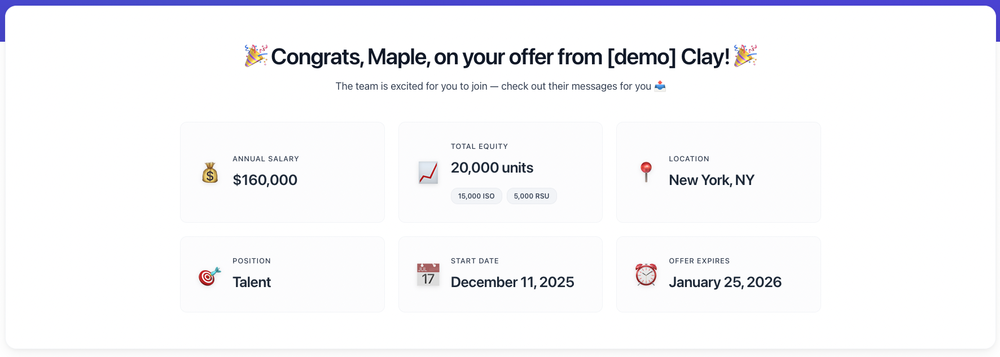
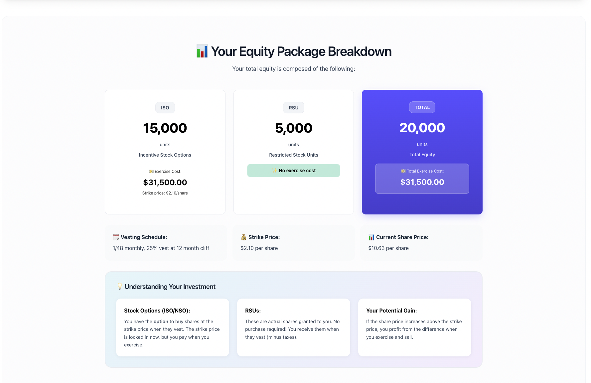
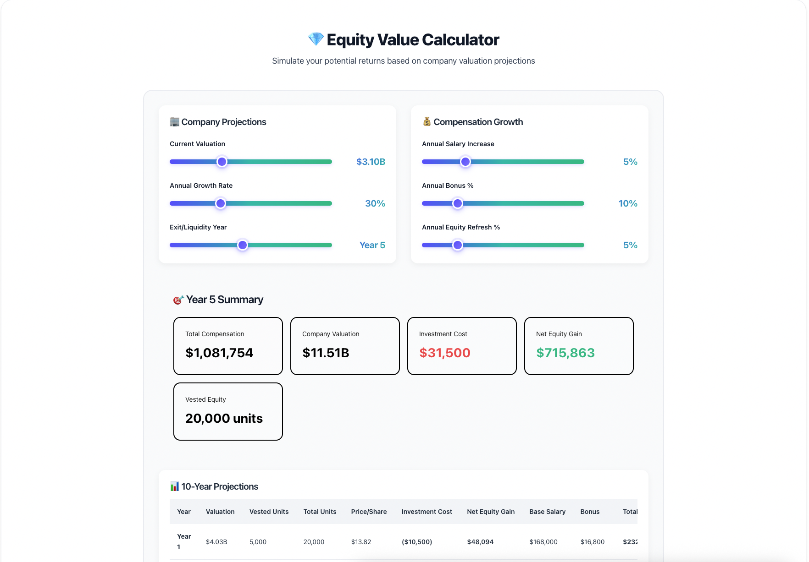
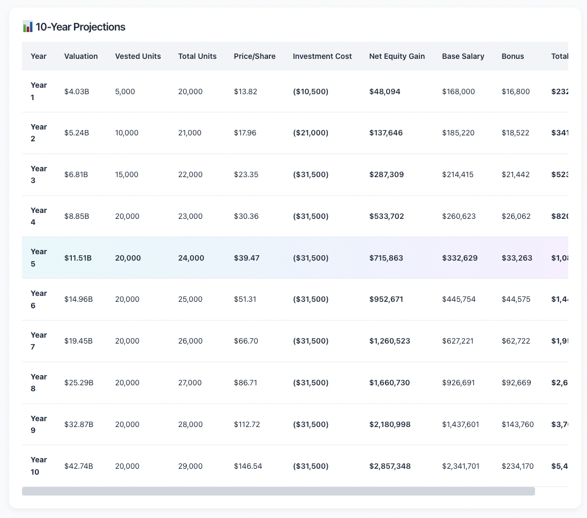
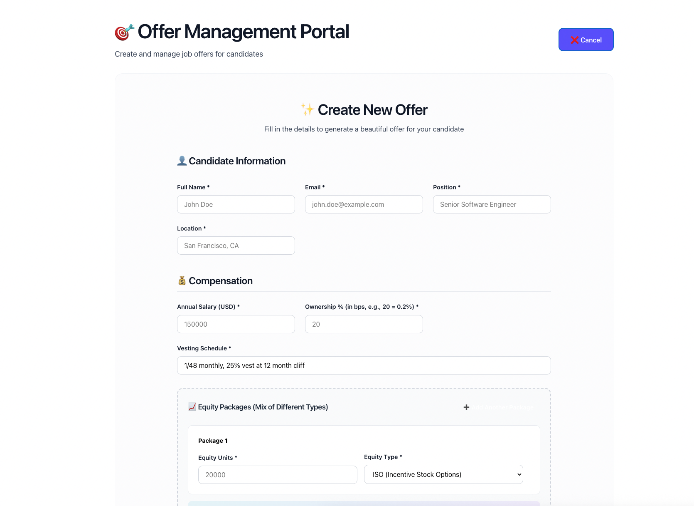

# 🎉 Maple Offer Portal

A beautiful, modern web application for presenting tech job offers to candidates with interactive compensation calculators and equity projections.


## ✨ Features

### 🎯 For Candidates

#### **Beautiful Offer Display**
- **Personalized Welcome**: Custom welcome message with candidate name and company branding
- **Comprehensive Compensation Breakdown**: Clear display of salary, equity packages, and benefits
- **Mixed Equity Types**: Support for ISO, NSO, and RSU equity packages with detailed breakdowns
- **Investment Cost Transparency**: Shows exercise costs for stock options vs. no-cost RSUs
- **Vesting Schedule**: Clear visualization of equity vesting timeline

#### **Interactive Equity Calculator** 🧮
- **10-Year Projections**: Model your equity value over a decade
- **Customizable Parameters**:
  - Company valuation slider ($1M - $10B)
  - Annual growth rate (0-100%)
  - Salary increase projections
  - Bonus percentage
  - Equity refresh grants
  - Exit year selection
- **Real-time Calculations**:
  - Price per share projections
  - Investment costs for exercising options
  - Net equity gains after costs
  - Total compensation including equity
- **Beautiful Visualizations**: Colorful gradients and smooth interactions

### 🛠 For Recruiters

#### **Offer Management Dashboard**
- **Create Offers**: Intuitive form to build comprehensive job offers
- **Edit Existing Offers**: Update any offer details after creation
- **Multiple Equity Packages**: Add mixed equity types (ISO + NSO + RSU) in a single offer
- **Preview & Share**: Generate unique offer links to share with candidates
- **Offer Library**: View and manage all created offers

#### **Flexible Data Model**
- Salary in various currencies
- Custom vesting schedules
- Company valuation and share information
- Strike prices and preferred share prices
- Benefits packages
- Team messages and customization

## 🎨 Design

Built with a modern, clean aesthetic inspired by [Clay.com](https://clay.com):
- **Vibrant gradients**: Purple to teal color schemes
- **Smooth animations**: Micro-interactions throughout
- **Colorful range sliders**: Beautiful, interactive controls
- **Professional typography**: SF Pro Display with careful spacing
- **Accessibility-first**: High contrast text and clear visual hierarchy

## 📸 Screenshots

### Candidate Experience

#### Compensation Overview
*Clear breakdown of salary, equity, and ownership*



#### Equity Package Breakdown
*Detailed view of mixed equity types with investment costs*



#### Interactive Calculator
*10-year equity projections with customizable parameters*



#### Calculator Projections Table
*Detailed year-by-year breakdown of equity value and compensation*



### Recruiter Experience

#### Offer Management Dashboard
*View all created offers with quick actions*


#### Create Offer Form
*Comprehensive form for building job offers*



## 🚀 Getting Started

### Prerequisites
- Node.js (v18 or higher)
- npm or yarn

### Installation

1. **Clone the repository**
```bash
git clone <repository-url>
cd maple_comp_website
```

2. **Install dependencies**
```bash
npm install
```

3. **Start the development server**
```bash
npm run dev
```

4. **Open your browser**
Navigate to `http://localhost:5173` (or the port shown in terminal)

### Build for Production

```bash
npm run build
```

The built files will be in the `dist/` directory.

## 📁 Project Structure

```
maple_comp_website/
├── src/
│   ├── components/
│   │   ├── EquityCalculator.jsx    # Interactive 10-year equity calculator
│   │   └── EquityCalculator.css
│   ├── pages/
│   │   ├── OfferView.jsx           # Candidate-facing offer display
│   │   ├── OfferView.css
│   │   ├── OfferManage.jsx         # Recruiter dashboard & create form
│   │   ├── OfferManage.css
│   │   ├── OfferEdit.jsx           # Edit existing offers
│   │   └── OfferEdit.css
│   ├── context/
│   │   └── OffersContext.jsx       # Global state management
│   ├── App.jsx                     # Main app with routing
│   ├── main.jsx                    # Entry point
│   └── index.css                   # Global styles
├── sample.json                     # Sample offer data structure
├── package.json
├── vite.config.js
└── README.md
```

## 🎯 Key Technologies

- **React 18**: Modern hooks-based components
- **React Router DOM**: Client-side routing
- **React Context API**: State management
- **Vite**: Fast build tool and dev server
- **CSS3**: Custom styling with gradients and animations
- **JavaScript ES6+**: Modern syntax and features

## 🔧 Configuration

### Sample Data
The `sample.json` file contains the data structure for offers. Key fields:

```json
{
  "candidate_full_name": "Maple Law",
  "candidate_email": "maple.law@example.com",
  "annual_salary_cents": 16000000,
  "equity_units": 20000,
  "equity_packages": [
    {
      "equity_units": 15000,
      "equity_unit_type": "iso"
    },
    {
      "equity_units": 5000,
      "equity_unit_type": "rsu"
    }
  ],
  "organization": {
    "name": "Demo Company",
    "valuation_cents": 310000000000,
    "shares_outstanding": 291629820,
    "strike_price_cents": 210,
    "preferred_share_price_cents": 1063
  }
}
```

### Customization
- **Colors**: Update CSS variables in `src/index.css`
- **Calculator Defaults**: Modify initial state in `EquityCalculator.jsx`
- **Routing**: Configure routes in `src/App.jsx`

## 💡 Features in Detail

### Mixed Equity Support
Create offers with multiple equity types in a single package:
- **ISO** (Incentive Stock Options): Tax-advantaged options
- **NSO** (Non-Qualified Stock Options): Standard options
- **RSU** (Restricted Stock Units): Direct share grants

Each type displays:
- Unit count
- Investment/exercise costs (for options)
- "No exercise cost" badge (for RSUs)

### Investment Cost Calculations
The calculator accurately computes:
- Exercise cost for ISO/NSO based on strike price
- Zero cost for RSU grants
- Net equity gain after subtracting investment costs
- Total compensation including cash and equity

### Equity Calculator Features
- **Realistic Vesting**: 25% cliff at year 1, then monthly vesting
- **Equity Refresh**: Annual refresh grants (configurable %)
- **Growth Projections**: Compound annual growth rate
- **Salary Increases**: Model career progression
- **Bonus Calculations**: Percentage-based bonuses
- **Exit Year**: Highlight specific exit scenarios

## 🎨 Design Principles

1. **Clarity First**: Financial data is complex—make it simple
2. **Visual Hierarchy**: Important info stands out
3. **Playful Yet Professional**: Engaging but trustworthy
4. **Mobile Responsive**: Works on all screen sizes
5. **Performance**: Fast load times and smooth interactions

## 🤝 Contributing

This is a demonstration project. Feel free to fork and adapt for your needs!

## 📝 License

MIT License - feel free to use this project as inspiration for your own offer pages.

## 🙏 Acknowledgments

- Design inspiration from [Clay.com](https://clay.com)
- Built with modern React patterns and best practices
- Created to make job offers more transparent and engaging

---

**Made with 💜 for better offer experiences**

